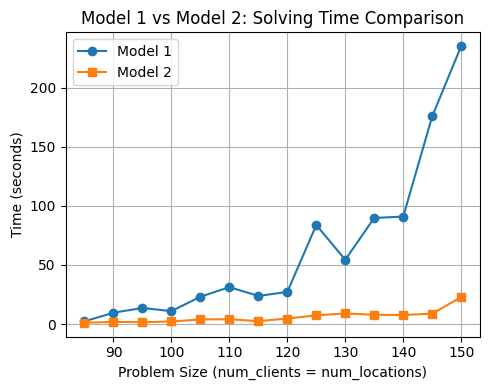

---
# try also 'default' to start simple
theme: seriph
# Force dark mode for exports/printing
colorSchema: dark
# aspectRatio: 2/1
# random image from a curated Unsplash collection by Anthony
# like them? see https://unsplash.com/collections/94734566/slidev
background: https://images.unsplash.com/photo-1606567595334-d39972c85dbe?q=80&w=687&auto=format&fit=crop&ixlib=rb-4.1.0&ixid=M3wxMjA3fDB8MHxwaG90by1wYWdlfHx8fGVufDB8fHx8fA%3D%3D
# https://cover.sli.dev
# some information about your slides (markdown enabled)
title: Hands-On Modeling
info: |
  ## Jens-Peter Joost
  Presentation slides for Optimization for all Hands-On Session.
  Find notebook [here](https://github.com/jpjj/O4A-Hands-On-Modeling)
# apply UnoCSS classes to the current slide
# class: text-center
# https://sli.dev/features/drawing
drawings:
  persist: false
# slide transition: https://sli.dev/guide/animations.html#slide-transitions
transition: slide-left
# enable MDC Syntax: https://sli.dev/features/mdc
mdc: true
# duration of the presentation
duration: 35min

hide: false
---

## Know the trick = 10x better performance
 
 

 

### The Art of Mathematical Modeling

  next page <carbon:arrow-right />

---
zoom: 1.2
layout: center
---

### Example

 

# Maximum Coverage Problem 

 

### Objective:

 
 
- 🏪 Place facilities 
- 👨 Cover as many clients as possible 

 
 

---
zoom: 1.5
layout: center
---

## Constraints:

 

 

- 🧩 Every facility serves different clients
- 💰 You can only place $B$ facilities in total

 
 
 
 

---
zoom: 1.5
layout: center
---

## The catch

- 📝 You can formulate this problem in two different ways.

- ✅ Either, when solved, yields the optimal placement of facilities.

- 😏 But one formulation is solved much faster

---
zoom: 1.1
---

## Model comparison (1/2)

 

Model 2 runs more than 10x faster and scales much better.

 

 

 

---
zoom: 1.1
---

## Model comparison (2/2)

 
 
 

|                  | Model 1                                              | Model 2                                      |
| ---------------- | ---------------------------------------------------- | -------------------------------------------- |
| **Variables**    | $\textcolor{red}{O(n \cdot m)}$                      | $\textcolor{green}{O(n + m)}$                |
| **Constraints**  | $\textcolor{red}{O(n \cdot m)}$                      | $\textcolor{green}{O(m)}$                    |

where $n = |N|$ (number of facilities) and $m$ (number of clients).

 
 

---
layout: center
---

# Live Session and more Modeling Know-How:

 

 

 

## Registration Link in the comments!

---
zoom: 0.9
layout: center
---

## Model 1

**Decision Variables:**

$$x_i = \begin{cases} 1 & \text{if facility is placed at location } i \in N \\ 0 & \text{otherwise} \end{cases}$$

$$y_{ij} = \begin{cases} 1 & \text{if facility } i \text{ serves client } j \\ 0 & \text{otherwise} \end{cases} \quad i \in N, \, j \in S_i$$

**Objective:**
$$\max \sum_{i \in N} \sum_{j \in S_i} y_{ij}$$

**Subject to:**
$$\sum_{i \in N} x_i \leq B$$
$$\sum_{i: j \in S_i} y_{ij} \leq 1 \quad \forall j$$
$$y_{ij} \leq x_i \quad \forall i \in N, \, j \in S_i$$

where $S_i$ is the set of clients that facility $i$ can serve.

---
zoom: 0.9
layout: center
---

## Model 2

**Decision Variables:**

$$x_i = \begin{cases} 1 & \text{if facility is placed at location } i \in N \\ 0 & \text{otherwise} \end{cases}$$

$$z_j = \begin{cases} 1 & \text{if client } j \text{ is served} \\ 0 & \text{otherwise} \end{cases}$$

**Objective:**
$$\max \sum_{j} z_{j}$$

**Subject to:**
$$\sum_{i \in N} x_i \leq B$$
$$z_j \leq \sum_{i \in S_j} x_i \quad \forall j$$

where $S_j$ is the set of facilities that can serve client $j$.

